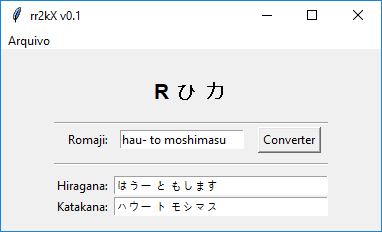
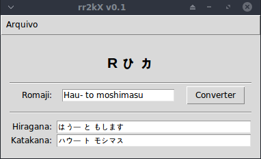
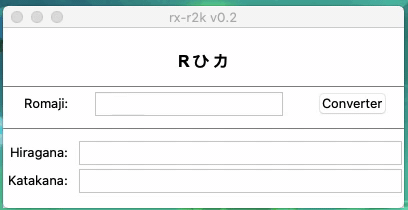

rx-r2k
------

This is a python3/tk written software aimed to convert romaji into kana.

To use when keyboard changes are not possible or just for training.

Dependencies:
- romkan (install it with: pip install romkan)

Binaries:
- Binaries are provided for Windows 10 - 64bits 

Screenshots
----------

